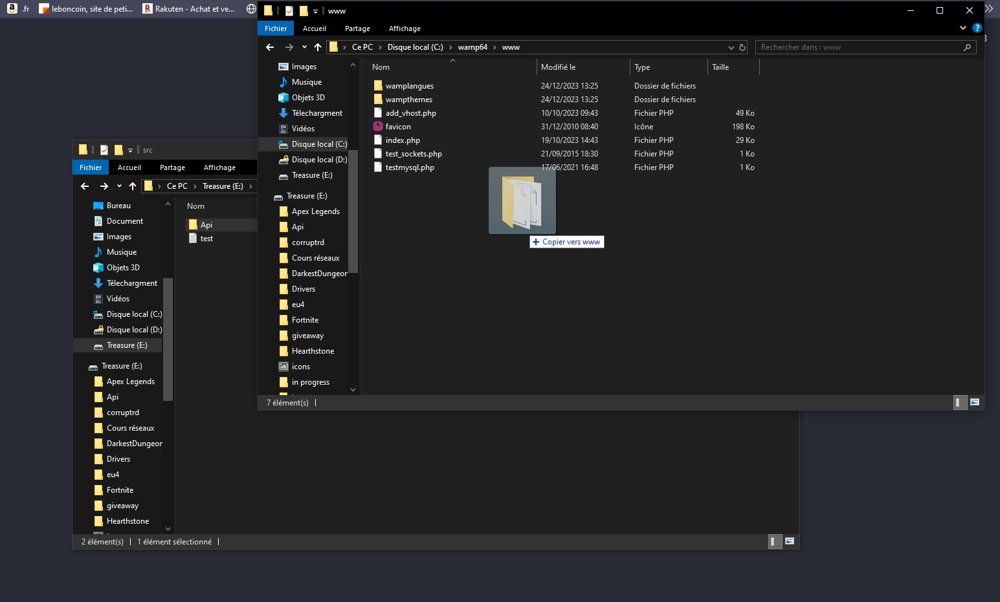
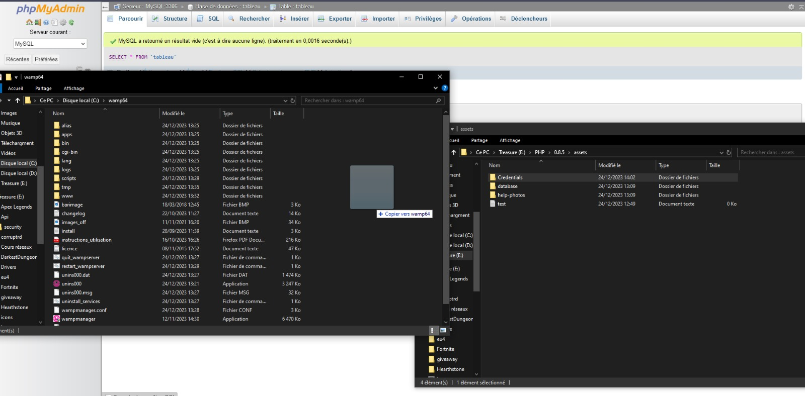
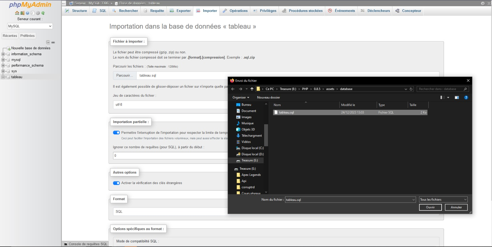
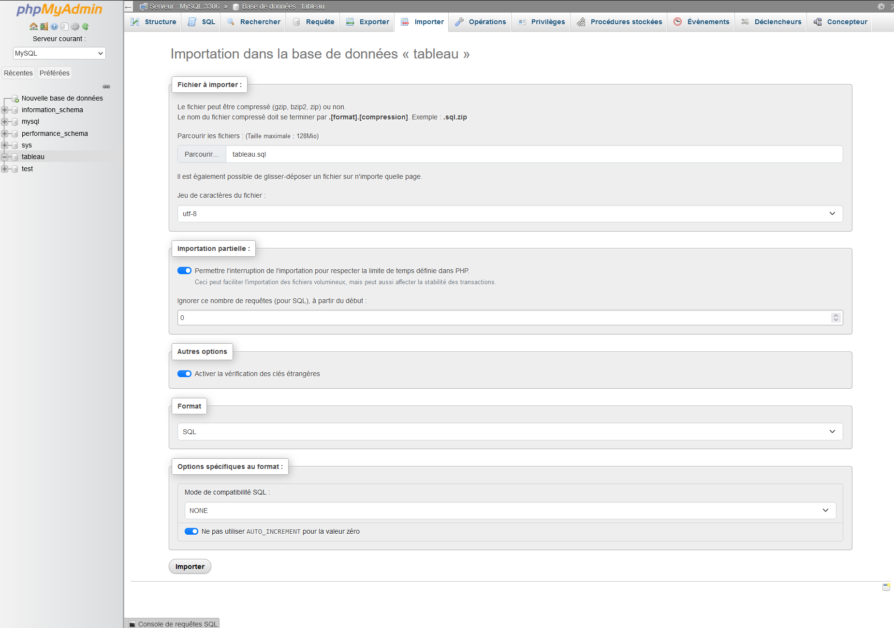
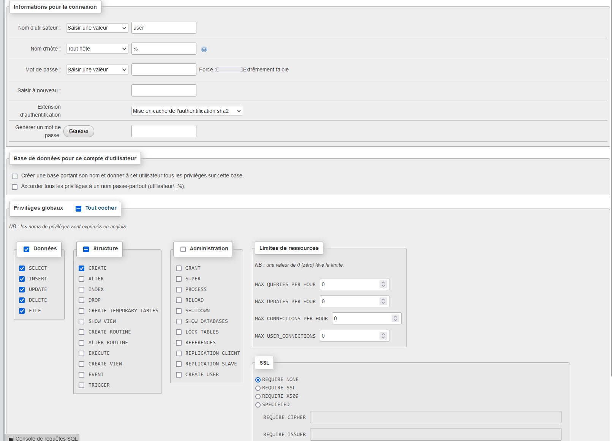

# Depot du DAL PHP de PHAM ALEXANDRE
⚠️ • Merci de bien lire le manuel d'installation pour un mise en route du DAL sans emcombre  
⚠️ • Le code fonctionne en ***PHP 8.1*** , le code ***ne fonctionnera pas*** sur des version inférieures à PHP 7  et il n'est pas garanti que celui fonctionne pour les autre         versions de PHP 

⚠️ •Le code a ***impérativement*** besoin de ***Wampserver*** pour fonctionner  veillez à l'avoir déja installé avant d'installer le code 

## A Propos
Le dépot  contient les  fichier pour installer  un DAL  qui permet de  mettre en place un service web , service web qui  permet de trier un tableau  (tri à bulle ou tri rapide) donné par un utilisateur dans l'url du service web et qui renvoie le tableau trié à l'utilisateur au format json
## Syntaxe de la requete 
Arguments : 

 **méthode de tri  disponibles**

• `BubbleSort`

• `QuickSort`

**le tableau à trier :**
Exemple : [544,567,144,17]

La requete à envoyer  au service se décompose en  http://[***adresse du service***]?type= [***Le Type de Tri***] &t= [***Le Tableau à trier entouré de crochets***] 

exemple : http://localhost/Api/?type=QuickSort&t=[1,14,709,2152,48,1471,14]

Note : Les décimaux ne sont ***PAS*** pris en charge , l'utilisation du  format  des chiffre de type 0[chiffre] (05 par exemple) est   déconseillée

## Installation 
1. Installez WampServer si ce n'est pas déja fait 

2. Déplacez  le dossier ***Api*** dans le réperoire suivant **C:\wamp64\www**
 

 
3. Déplacez  le dossier ***Credential*** présent dans ***"assets"*** dans  **C:\wamp64**

 
4. Lancez ***WampServer***
 
5. Importez la base de donnée fournie  (du dossier asset/database)  dans votre ***PHPmyAdmin*** (assurez vous d'avoir les droits nécessaires pour creer une table et un un utilisateur) 
 
   
6. Créez un utilisateur phpmyadmin  avec ***des droit limités*** ***(SELECT, INSERT, UPDATE, DELETE, CREATE, FILE)***  qui possède les meme informations de connexion que  les credentials du  fichier **db.json** (présent dans le dossier ***Credentials***)  

7. Entrez  localhost/Api/?type=QuickSort&t=[***le tableau à trier***]  dans  l'url de votre navigateur pour utiliser le service 

