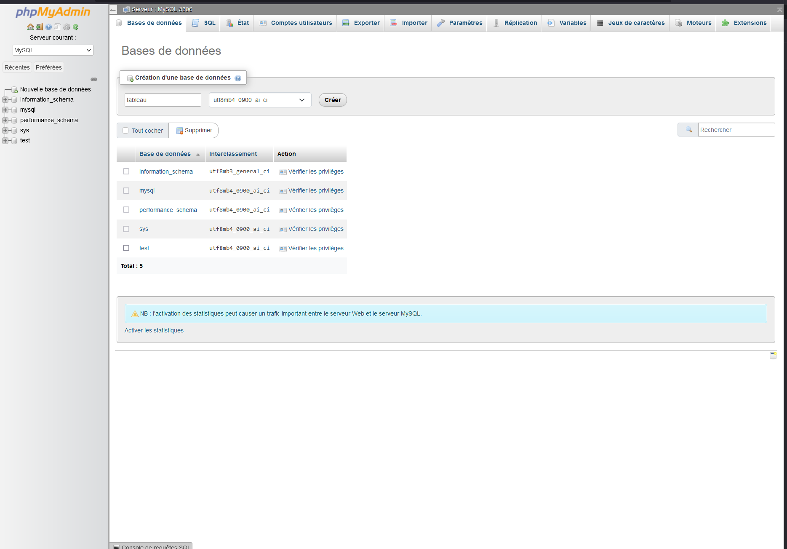

# Depot du DAL PHP de PHAM ALEXANDRE
⚠️ • Merci de bien lire le manuel d'installation pour un mise en route du DAL sans emcombre  
⚠️ • Le code fonctionne en ***PHP 8.1*** , le code ***ne fonctionnera pas*** sur des version inférieures à PHP 7  et il n'est pas garanti que celui fonctionne pour les autre         versions de PHP 

## A Propos
Le dépot  contient les  fichier pour installer  un DAL  qui permet de  mettre en place un service web , service web qui  permet de trier un tableau  (tri à bulle ou tri rapide) donné par un utilisateur dans l'url du service web et qui renvoie le tableau trié à l'utilisateur au format json
## Syntaxe de la requete 
Arguments : 

 **méthode de tri  disponibles**

• `BubbleSort`

• `QuickSort`

**le tableau à trier :**
Exemple : [544,567,144,17]

La requete à envoyer  au service se décompose en  http://[***adresse du service***]?type= [***Le Type de Tri***] &t= [***Le Tableau à trier entouré de crochets***] 

exemple : http://localhost/Api/?type=QuickSort&t=[1,14,709,2152,48,1471,14]

Note : Les décimaux ne sont ***PAS*** pris en charge , l'utilisation du  format  des chiffre de type 0[chiffre] (05 par exemple) est   déconseillée

## Installation 
Vous devez deplacer le contenu du dossier **"src"** dans le réperoire suivant **C:\wamp64\www** et dans le contenu  du dossier "assets" vous devez importer la base de donnée fournie dans votre PHPmyAdmin 
nommez la base  de données "tableau"  ou créez une nouvelle avec les meme caractèristiques que la base de donnée fournie    ensuite vous devez créer un utilisateur phpmyadmin  avec des droit limités (SELECT, INSERT, UPDATE, DELETE, CREATE, FILE)  qui possède les meme informations de connexion que sur le fichier **db.json** puis de mettre le paramètre  ***MAX QUERIES PER HOUR*** dans ****limites de ressources**** à 150  et vous devez aussi créer un dossier nommé **"Credentials"**  dans le répertoire suivant : **C:\wamp64** et placer le fichier **db.json** (présent dans le dossier **"assets"** ) dedans.

